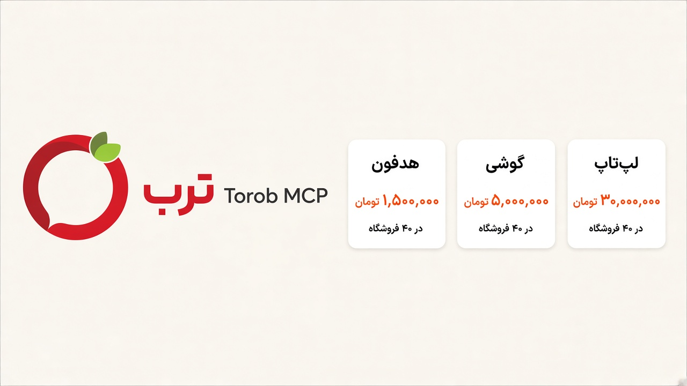
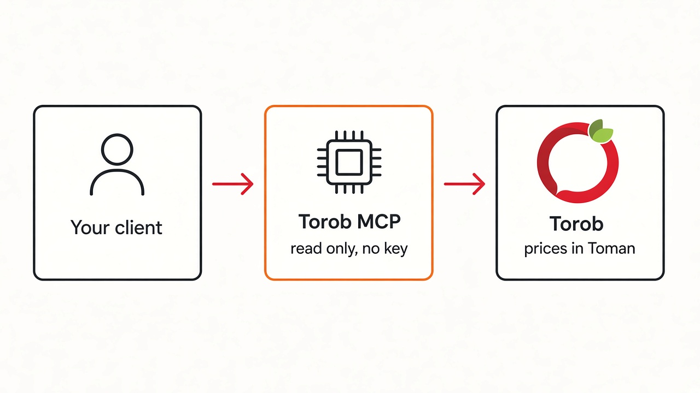

# Torob MCP



Read-only MCP server for [Torob](https://torob.com/). Search, cheapest price in Toman, online shops, in-store stock, specs, variants, and the price chart. No API key. Nothing is written back to Torob.

This project is not affiliated with Torob.

## Use it

The server is already running. Add this URL in your agent. No API key, no install.

```
https://torob-mcp-production.up.railway.app/mcp
```

Then ask in normal language. “Cheapest wireless headphones under 2 million toman” is enough. The agent calls Torob and answers with prices in Toman.

### Cursor

Open Cursor Settings, then MCP, and add a new server. Or put this in `~/.cursor/mcp.json` (all projects) or `.cursor/mcp.json` (this project only):

```json
{
  "mcpServers": {
    "torob": {
      "url": "https://torob-mcp-production.up.railway.app/mcp"
    }
  }
}
```

Save and reload. Torob should show up under MCP tools.

### Claude

On claude.ai or Claude Desktop: Customize, then Connectors, then Add custom connector. Paste the URL above. Leave OAuth empty. This server has no login.

In Claude Code:

```bash
claude mcp add --transport http torob https://torob-mcp-production.up.railway.app/mcp
```

On a Team or Enterprise plan, an owner adds the connector first. Each person then connects it from Customize.

### ChatGPT

ChatGPT only accepts a public HTTPS address, which this is.

Open Settings, then Apps (or Connectors). Turn on Developer mode under Advanced. Create a connector, name it Torob, paste the URL, and choose no authentication. In a new chat, enable that connector before you ask.

The menu has moved around. If you do not see Developer mode under Connectors, look under Settings, then Security.

### Other agents

Any client that takes a remote MCP URL can use the same address. Pick Streamable HTTP if it asks for a transport. There is no token to paste.

## Tools

| Tool | What it answers |
|---|---|
| `torob_suggest` | Vague wording to real search phrases |
| `search_torob` | Cards: cheapest Toman price, shop count, URL. Optional `brand_id` with a category |
| `browse_category` | One category, plus child categories |
| `search_filters` | Category ids and the price span for a query |
| `product_details` | Price range, category, brand, key specs |
| `product_sellers` | Online shops, city, score, order notes, unreliable-price flag, min/median/max |
| `product_guide` | Torob's written guide for the product. Not buyer reviews |
| `product_stores` | Physical shops: address, hours, open/closed, price |
| `shop_profile` | Shop name, domain, city, enamad, score |
| `product_variants` | Storage / RAM / region siblings and their prices |
| `product_price_chart` | Average and minimum series |
| `product_url` | UUID to a torob.com link |
| `get_products_batch` | Up to 10 cards |
| `compare_products` | 2–5 products, only specs that differ |
| `find_best_value` | Under a Toman budget, ranked by how many shops list it |
| `similar_products` | Torob's similar list |

Product ids are UUIDs (`random_key`). The price on a card is the cheapest shop Torob is showing, in Toman. Some shop rows are flagged `price_unreliable`; `product_sellers` hides those unless you ask for them. `total_items_estimate` is Torob's count and often stops at 1200 (`estimate_capped`).

Price bounds apply to the page that was fetched. Budget questions belong on `find_best_value`.

Search sets `low_confidence` when none of the returned titles contain the query words, and lists those words in `unmatched_terms`.

Torob does not publish buyer reviews (score, date, likes, pros and cons) or a product Q&A. `product_guide` is the write-up on the product page. Shop trust is `buyer_notes` on `product_sellers`: recent order volume and how many buyers followed up an order.

## How fresh the data is



Nothing is stored as a product database. Each call reads Torob's public API. A response is kept in memory for 3 minutes so a follow-up question does not hit Torob again immediately. After that, the next call reads Torob again. Prices, stock, and shop lists change on Torob's side whenever they change there.

GitHub Actions runs `scripts/verify.mjs` against the live endpoint every hour. A red run means the endpoint or Torob's response shape broke. That is the signal to update the server. The action does not refresh prices on a schedule. Prices refresh when someone asks.

## Check

```bash
npm start
node scripts/verify.mjs
```

Examples: [examples/sample-calls.md](examples/sample-calls.md).
